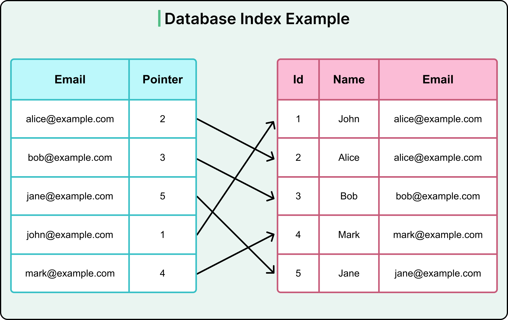

---
# try also 'default' to start simple
theme: seriph
# random image from a curated Unsplash collection by Anthony
# like them? see https://unsplash.com/collections/94734566/slidev
background: ./blackripple.jpg
# some information about your slides (markdown enabled)
title: Indexed DB
# apply UnoCSS classes to the current slide
class: text-center
# https://sli.dev/features/drawing
drawings:
  persist: false 
# slide transition: https://sli.dev/guide/animations.html#slide-transitions
transition: fade-out
# enable MDC Syntax: https://sli.dev/features/mdc
mdc: true
fonts:
  sans: Roboto

---

# Welcome to <span class="accent">IDB</span>


<style>
h1 > .accent { 
  font-style: italic;
  font-size: 4.5rem;
  font-weight: 500;
  color: #ED8F03;
}
</style>

<!--
The last comment block of each slide will be treated as slide notes. It will be visible and editable in Presenter Mode along with the slide. [Read more in the docs](https://sli.dev/guide/syntax.html#notes)
-->

---


# IDB 와 LocalStorage 비교

| 구분 | LocalStorage | IndexedDB |
| :--- | :--- | :--- |
| **저장용량** | 약 5MB로 제한됨 | 사용자 디스크 공간에 따라 유동적 |
| **데이터 타입**| 문자열(String)만 지원함 | 다양한 데이터 타입(Object, File, Blob 등) 지원함 |
| **API** | 동기(Synchronous) 방식 | 비동기(Asynchronous) 방식 |
| **쿼리** | 단순 Key-Value, 복잡한 쿼리 불가 | 인덱스를 사용한 복잡한 쿼리 가능함 |
| **용도** | 간단한 설정, 작은 데이터 저장에 적합 | 대용량 데이터, 오프라인 애플리케이션에 적합 |
| **성능** | 동기식으로 메인 스레드 블로킹 가능 | 비동기식으로 메인 스레드 블로킹 없음 |
| **Web Worker**| 사용 불가 | 사용 가능 |


<!--
You can have `style` tag in markdown to override the style for the current page.
Learn more: https://sli.dev/features/slide-scope-style
-->

<!--
Q1. Idb 의 비동기가 의미하는 것
Idb 의 접근은 메인 스레드가 아니라 별도의 스레드에서 실행된다.

Q2. 그럼 워커에서 실행할 필요가 있나?
일반적인 IndexedDB의 비동기 특성 덕분에, DB 접근 자체로는 메인 스레드를 블락하는 일이 없으니 ‘오로지 IndexedDB 사용’만을 목적으로 워커를 꼭 써야 하는 건 아닙니다.
하지만, 워커 사용을 고려할 수 있는 경우는 다음과 같습니다:
대용량 데이터 파싱/변환 등 CPU 집약 작업을 동반할 때
예: IndexedDB에서 많은 데이터를 읽어와서 복잡한 계산, JSON 파싱, 압축 해제 등의 무거운 처리가 필요한 경우.
이런 연산은 메인 스레드에서 하면 UI가 버벅일 수 있는데, 워커에서 하면 렌더링이 부드럽게 유지됩니다.
데이터를 읽어온 뒤 추가적인 비동기 없는 연산이 이어질 때
-->

---

# 데이터베이스 인덱싱 (Indexing)

데이터베이스 인덱스는 책의 **색인**과 같음.

- **목적**: 테이블에서 원하는 데이터를 더 빠르게 찾기 위해 사용함.
- **작동 방식**: 특정 컬럼의 값과 해당 레코드의 위치를 미리 정렬하여 저장해 둠.
- **장점**: `SELECT` 쿼리의 검색 속도가 크게 향상됨.
- **단점**:
    - 인덱스 저장을 위한 추가 디스크 공간 필요.
    - `INSERT`, `UPDATE`, `DELETE` 작업 시 인덱스도 업데이트되어 성능 저하 가능성 있음.

<br/>

*IndexedDB도 이름에서 알 수 있듯이, **인덱스**를 사용하여 데이터를 효율적으로 검색함.*

---

# 인덱싱 예시

<div class="flex h-full">
  
</div>

---

# 데이터베이스의 ACID 원칙

ACID는 데이터베이스 트랜잭션이 안전하게 수행되기 위해 보장해야 하는 네 가지 속성을 의미함.

<div class="grid grid-cols-2 gap-4">
<div>

### **A**tomicity (원자성)

- 트랜잭션의 모든 작업이 **전부 성공**하거나 **전부 실패**해야 함.
- 'All or Nothing'

</div>
<div>

### **C**onsistency (일관성)

- 데이터베이스는 트랜잭션 성공 후 항상 **일관된 상태**를 유지해야 함.

</div>
<div>

### **I**solation (고립성)

- 여러 트랜잭션이 동시에 실행될 때, 서로에게 영향을 주지 않고 **독립적으로 실행**되는 것처럼 보여야 함.

</div>
<div>

### **D**urability (지속성)

- 성공적으로 완료된 트랜잭션의 결과는 시스템 오류 발생 시에도 **영구적으로 저장**되어야 함.

</div>
</div>

---

# IndexedDB 란?

브라우저에 내장된 **Key-Value 형태의 NoSQL 데이터베이스**임.

<div class="grid grid-cols-2 gap-x-12 gap-y-6 mt-8 text-left">

<div class="flex items-start gap-4">
  <div class="i-carbon-cloud text-5xl text-orange-500" />
  <div>
    <h5 class="font-bold">대용량 데이터 저장</h5>
    <span class="text-sm">문자열, 파일, Blob 등 다양한 타입의 데이터 저장 가능.</span>
  </div>
</div>

<div class="flex items-start gap-4">
  <div class="i-carbon-async text-5xl text-orange-500" />
  <div>
    <h5 class="font-bold">비동기 API</h5>
    <span class="text-sm">메인 스레드를 차단하지 않아 UI 반응성에 영향을 주지 않음.</span>
  </div>
</div>

<div class="flex items-start gap-4">
  <div class="i-carbon-task-approved text-5xl text-orange-500" />
  <div>
    <h5 class="font-bold">트랜잭션 지원</h5>
    <span class="text-sm">ACID 원칙을 따르는 트랜잭션으로 데이터 무결성 보장.</span>
  </div>
</div>

<div class="flex items-start gap-4">
  <div class="i-carbon-search text-5xl text-orange-500" />
  <div>
    <h5 class="font-bold">인덱스 기반 쿼리</h5>
    <span class="text-sm">인덱스를 사용하여 데이터를 빠르고 효율적으로 검색함.</span>
  </div>
</div>

<div class="flex items-start gap-4">
  <div class="i-carbon-security text-5xl text-orange-500" />
  <div>
    <h5 class="font-bold">동일 출처 정책</h5>
    <span class="text-sm">동일 출처 정책으로, 생성된 출처에서만 DB 접근 가능.</span>
  </div>
</div>

</div>

---

# IndexedDB: DB 생성 및 업그레이드

`indexedDB.open()` 메소드로 데이터베이스를 열거나 생성함.

```js
const request = indexedDB.open('DeveloperDB', 1);

// DB 버전이 변경되거나 처음 생성될 때 실행됨.
request.onupgradeneeded = (event) => {
  const db = event.target.result;
  // 'developers' Object Store(테이블) 생성
  const store = db.createObjectStore('developers', { keyPath: 'name' });
  // 검색을 위한 인덱스 생성
  store.createIndex('ageIndex', 'age', { unique: false });
};

let db; 

request.onsuccess = (event) => {
   db = event.target.result;
};
``` 

<!--
-   **`open(dbName, version)`**: 데이터베이스 이름과 버전을 인자로 받음.
-   **`onupgradeneeded`**: 스키마(Object Store, Index) 변경은 이 이벤트 핸들러 내에서만 가능함.
-   **`createObjectStore`**: RDB의 테이블과 유사. `keyPath`가 Primary Key 역할.
-   **`createIndex`**: 특정 속성을 기준으로 데이터를 검색하도록 인덱스 생성.
-->

---

# IndexedDB: 트랜잭션을 이용한 CRUD

데이터 추가, 조회, 수정, 삭제는 모두 **트랜잭션** 내에서 이루어져야 함.

<div class="grid grid-cols-2 gap-4 mt-4">

<div>
<h5>Create (추가)</h5>
```js
const tx = db.transaction('developers', 'readwrite');
const store = tx.objectStore('developers');
store.add({
  name: 'Alice',
  age: 30,
  salary: 5000,
  lang: 'JavaScript'
});
```
</div>

<div>
<h5>Read (조회)</h5>
```js
const tx = db.transaction('developers', 'readonly');
const store = tx.objectStore('developers');
const req = store.get('Alice');
req.onsuccess = () => {
  console.log(req.result);
};
```
</div>

<div>
<h5>Update (수정)</h5>
```js
const tx = db.transaction('developers', 'readwrite');
const store = tx.objectStore('developers');
store.put({
  name: 'Alice', // keyPath 값은 동일
  age: 31,
  salary: 5500,
  lang: 'TypeScript'
});
```
</div>

<div>
<h5>Delete (삭제)</h5>
```js
const tx = db.transaction('developers', 'readwrite');
const store = tx.objectStore('developers');
store.delete('Alice');
```
</div>

</div>

<!--
Transaction Inactivity: An IDBTransaction will automatically become inactive and potentially commit if there are no pending requests associated with it at the end of the current JavaScript event loop iteration. setTimeout schedules a callback to run in a future task, effectively pausing the current task and allowing the IndexedDB transaction to become inactive before the setTimeout callback executes.
-->

---

# IndexedDB: 데이터 지속성 (Durability)

트랜잭션 생성 시 `durability` 옵션으로 디스크 기록 시점 제어, 안정성과 성능의 균형을 맞춤.

```js
const tx = db.transaction(
  'developers',
  'readwrite',
  { durability: 'strict' } // durability 옵션 지정
);
```

-   `default`
    -   브라우저의 기본 동작. 일반적으로 성능과 안정성의 균형을 맞춘 설정임.
-   `strict`
    -   **높은 안정성**: 트랜잭션 `complete` 전 OS가 디스크에 즉시 기록하도록 요청. 시스템 충돌 시 데이터 유실 확률 매우 낮음.
-   `relaxed`
    -   **높은 성능**: OS가 자체 버퍼링 전략에 따라 디스크에 기록. 디스크 I/O가 줄어 성능은 향상되나 시스템 충돌 시 데이터 유실 가능성 있음.

---

# IndexedDB: 인덱스와 커서를 이용한 조회

인덱스로 keyPath 외 다른 속성으로 효율적인 검색 가능. 커서는 여러 데이터 순회 시 사용함.

<div class="grid grid-cols-2 gap-4 mt-4">

<div>
<h5>Index로 조회하기</h5>
<p class="text-sm">30세 이상 모든 개발자 찾기</p>
```js
const tx = db.transaction('developers', 'readonly');
const store = tx.objectStore('developers');
const index = store.index('ageIndex');

// 30 이상인 key 범위 지정
const range = IDBKeyRange.lowerBound(30);

const req = index.getAll(range);
req.onsuccess = () => {
  console.log(req.result); // 30세 이상 개발자 배열
};
```
</div>

<div>
<h5>Cursor로 순회하기</h5>
<p class="text-sm">데이터를 하나씩 순회하며 작업</p>
```js
const tx = db.transaction('developers', 'readonly');
const store = tx.objectStore('developers');
const index = store.index('ageIndex');

const req = index.openCursor();
req.onsuccess = (event) => {
  const cursor = event.target.result;
  if (cursor) {
    console.log(cursor.value);
    cursor.continue(); // 다음 데이터로 이동
  } else {
    console.log('No more entries!');
  }
};
```
</div>

</div>

---

# IndexedDB: 에러 핸들링 및 롤백

모든 요청과 트랜잭션은 실패 가능. `onerror` 이벤트 핸들러로 오류 처리 필수.

```js
// DB 열기 요청 에러 발생 시
request.onerror = (event) => {
  console.error(`Database error: ${event.target.errorCode}`);
};

// 트랜잭션 내 에러 발생 시
const tx = db.transaction('developers', 'readwrite');
tx.onerror = (event) => {
  console.error(`Transaction error: ${event.target.error}`);
};

const store = tx.objectStore('developers');
// 이미 존재하는 keyPath 'Alice' 추가 시 에러 발생
const req = store.add({ name: 'Alice', age: 35, ... });

// 개별 요청의 에러는 트랜잭션 전체에 전파됨.
req.onerror = (event) => {
  console.error(`Add request error: ${event.target.error}`);
};
```
- 자동 롤백: 트랜잭션 내 한 작업이라도 실패하면 모든 작업이 자동으로 롤백되어 데이터 일관성 유지됨.

---
layout: default
---

# 정리

### Key Takeaways

- **IndexedDB는 단순한 저장소가 아닌, 브라우저의 진짜 '데이터베이스'**
  <br/>
  
- **모든 것은 비동기(Asynchronous)와 트랜잭션(Transaction) 위에서 동작**
  <br/>
  메인 스레드를 막지 않고, 데이터 무결성 보장.

- **인덱스(Index)를 적극적으로 활용**
  <br/>
  데이터 검색 성능을 극대화하는 핵심.

### Wrapper Library 사용하기

네이티브 API는 복잡. 실제 프로젝트에서는 `Promise` 기반 라이브러리 사용이 유리함

<!--
IndexedDB의 작업 자체는 메인 스레드가 아닌 내부(다른) 스레드에서 처리된다
단, 그 결과는 반드시 event loop(이벤트 루프)를 거쳐서, 메인 자바스크립트 코드(콜백/이벤트)의 실행 흐름으로 돌아온다
즉, IndexedDB의 비동기적 동작 구조와 이벤트 루프 처리 메커니즘은 ‘서로 독립적’이지만,
실제 자바스크립트 코드가 DB 결과를 받는 시점에서 이벤트 루프에 의존하게 된다
→ 이 덕분에 UI가 멈추지 않으면서도 DB 결과를 잘 받아볼 수 있다
-->

---
layout: center
class: text-center
---

# Q & A

<br/>

### 감사합니다.

<PoweredBySlidev mt-10 class="text-xs" />
