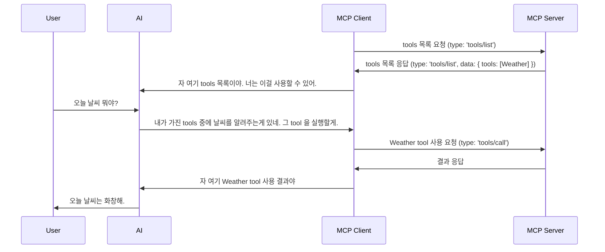

---
# You can also start simply with 'default'
theme: default
# random image from a curated Unsplash collection by Anthony
# like them? see https://unsplash.com/collections/94734566/slidev
# some information about your slides (markdown enabled)
title: MCP
# https://sli.dev/features/drawing
drawings:
  persist: false
# slide transition: https://sli.dev/guide/animations.html#slide-transitions
transition: slide-left
---

# MCP

Model Context Protocol

<!--
안녕하세요. 오늘은 최근 개발업계에서 큰 주목을 받고 있는 MCP에 대해 소개해드리겠습니다.

최근에 MCP 를 활용한 툴들이 많이 나오고 있습니다.
대표적으로 Claude Desktop 이나 Cursor 가 있는데요,
Claude Desktop 에서는 명령을 하면 AI 가 내 파일 시스템에 접근해서 파일을 변경할 수도 있고,
슬랙이나 노션에 글을 남길수도 있죠.

AI 가 능동적으로 어떤 작업을 수행할 수 있게 된 것인데, 그 배경에는 MCP 프로토콜이 있습니다.
-->

---
transition: fade-out
---

# 들어가기 전에...

<SlidevVideo v-click autoplay controls class="w-full h-full rounded-lg">
  <!-- Anything that can go in an HTML video element. -->
  <source src="/mcp_example.mp4" type="video/mp4" />
  <p>
    Your browser does not support videos. You may download it
    <a href="/myMovie.mp4">here</a>.
  </p>
</SlidevVideo>

<!--
MCP를 제대로 배우려면, 직접 시도해보는게 가장 빠른 길인것 같아서 간단한 프로젝트를 진행했습니다.

이 영상은 AI 에게 명령을 하면, AI 가 MCP 를 통해 함수를 호출하여 UI 를 업데이트하는 예시입니다.
신기하지 않나요?
-->

---
transition: fade-out
layout: image-right
image: /usbc.jpg
---

# MCP 란?

MCP는 애플리케이션이 LLM에 컨텍스트를 제공하는 방법을 표준화하는 오픈 프로토콜입니다.

<br />

#### 장점

- 미리 만들어진 MCP Server를 쉽게 통합할 수 있다.
- MCP Server 와 MCP Client 를 분리하여 안정성과 보안을 유지할 수 있다.
- 유연하게 사용할 수 있다.

  <br />
  <br />
  <br />
  <br />

Read more about [MCP](https://modelcontextprotocol.io/introduction)

<!--
MCP 는 LLM 과 애플리케이션의 통신을 표준화한 프로토콜입니다.

기존에는 AI 모델이 외부 시스템과 통신하려면 각 시스템마다 별도의 API를 만들고, 보안 정책과 데이터 포맷을 맞추는 등 복잡한 커스텀 작업이 필요했습니다. 

하지만 MCP를 사용하면 개발자는 하나의 통신 규격만 정의해서 수십 개의 툴과 데이터를 훨씬 더 쉽고 안전하게 다룰 수 있습니다. 
이로 인해 개발 생산성은 물론, 유지보수와 확장성 면에서도 큰 이점을 얻게 됩니다.
-->

---
transition: fade-out
---

# MCP


<!--
기존: AI 모델이 사용할 수 있도록, 시스템마다 별도의 API를 만들어야하고, 깊은 의존성이 생김

변경 후: MCP 통신 규격에 따라 정의를 하면 해당 코드를 여러 곳에서 재사용 할 수 있음.
-->

---
layout: two-cols
layoutClass: gap-16
transition: fade-out
---

# MCP 구조

MCP defines a **client-server architecture**

- **Host**

  - 유저가 인터렉션하는 어플리케이션
    <br /><span class="text-xs text-gray-700">(e.g. Claude Desktop, Cursor ...)</span>

- **MCP Client**

  - Host 어플리케이션 내부에서 실행
  - MCP Server 와의 통신을 담당

- **MCP Server**
  - Tools, Resources, Prompt 를 AI 에게 전달

<br />

<p class="text-sm text-gray-500">Read more about <a href="https://www.philschmid.de/mcp-introduction">MCP Structure</a></p>

::right::

<br />
<br />
<br />
<br />

<div v-click>

### MCP Server

- **Tools**
  - LLM 이 실행할 수 있는 함수
  - API 호출, 파일 읽기 및 쓰기 등등
- **Resources**
- **Prompt**
  - tools 을 호출하기 전 모델에게 전달할 프롬프트

</div>

<!--
Host 는 사용자와 상호작용 하는 애플리케이션입니다. 예를 들어 Claude Desktop, Cursor IDE, AI 챗봇 등이 여기에 해당합니다. 

비유하자면, Host는 레스토랑의 ‘셰프’입니다. 셰프는 요리를 책임지지만, 직접 시장에 가서 재료를 사오진 않죠.

MCP Client 는 셰프의 조수인데요, 
MCP Client는 Host 내부에 존재하며, MCP Server와 연결되어 있습니다. 이 친구는 셰프의 주문을 받아 심부름을 하죠. 예를들어 요리에 들어갈 재료를 사러 마트 심부름을 다녀옵니다.

MCP Server 는 마트입니다.
마트에는 여러 재료가 있죠.
조수가 셰프의 심부름을 받아 필요한 재료 목록을 넘겨주면 MCP 서버는 재료를 조수에게 건네주죠.

Tools 는 마트에 있는 재료들이라고 생각하시면 됩니다.
-->

---
transition: fade-out
---

# MCP 통신 흐름



<p class="text-sm text-gray-500"><a href="https://github.com/modelcontextprotocol/typescript-sdk/blob/590d4841373fc4eb86ecc9079834353a98cb84a3/src/server/index.ts#L167">소스 코드</a></p>

<!--
신선한 토마토가 있어요.

손님: 토마토 파스타 주세요

즉 MCP 란, MCP Client와 MCP Server가 서로 소통하는 규격, 즉 ‘서로 약속한 대화법’이라고 볼 수 있습니다.
-->

---
transition: fade-out
---

# MCP (MCP Client ↔ MCP Server)

```ts [method_type.ts] {all|1-2|4-7|8-11|12-15|16-19}
// initialize
method: z.literal("initialize");

// notifications
method: z.literal("notifications/cancelled");
method: z.literal("notifications/progress");
method: z.literal("notifications/tools/list_changed");

// resources
method: z.literal("resources/list");
method: z.literal("resources/templates/list");

// prompts
method: z.literal("prompts/list");
method: z.literal("prompts/get");

// tools
method: z.literal("tools/list");
method: z.literal("tools/call");
```

<p class="text-sm text-gray-500"><a href="https://github.com/modelcontextprotocol/typescript-sdk/blob/590d4841373fc4eb86ecc9079834353a98cb84a3/src/types.ts#L862">MCP Typescript SDK Source Code</a></p>

<!--
MCP 에는 이렇게 정해진 규격이 있습니다.
-->

---
transition: fade-out
---

# MCP Server Example

```ts [VestaBoardServer.ts] {all|1|3-6|8-18|19-21|all}{maxHeight: '90%'}
import { McpServer } from "@modelcontextprotocol/sdk/server/mcp.js";

const server = new McpServer({
  name: "vestaBoard",
  version: "1.0.0",
});

server.tool(
  "change-vestaBoard-theme", // tool name
  "Change the theme of the board", // tool description
  {
    theme: z.enum(["default", "sky", "peach", "magic"]), // tool parameters
  },
  async ({ theme }) => {
    // tool implementation
  },
);

const transport = new StdioServerTransport();
server.connect(transport);
```

<!--
MCPServer 란, MCP 프로토콜을 사용해 구현된 서버입니다.
AI 가 특정 동작을 요청할때 그 동작을 실제로 수행한다는 의미에서 서버가 붙은 것 같아요.

마치 우리가 REST API 를 날리면 서버가 그 요청을 받아 내부적으로 동작을 수행하는 것과 
똑같은 개념이죠.


이 코드는 아까 처음에 보여드린 영상에 나왔던 
vestaBoard 의 테마를 바꾸는 MCP Server 의 구현체입니다.

MCP SDK 를 사용하면 이렇게 간단하게 MCP Server 를 구현할 수 있습니다.

마지막에 transport 는 MCP 서버와 MCP 클라이언트간의 소통할 수 있는 채널을 의미하는데요,
표준 입출력을 활용해 소통하겠다는 의미입니다.

이론상, MCP 서버와 클라이언트간의 소통을 할때 MCP 프로토콜만 지키면
HTTPS 든, 소켓이던 스트림이던 상관 없습니다.
-->

---
transition: fade-out
---

# MCP Client Example

```ts [MCPClient.ts] {*}{maxHeight: '90%'}
const client = new Client({ name: 'mcp-client-cli', version: '1.0.0' });

this.transport = new StdioClientTransport({
  'node',
  args: ['/path/to/vestaBoardServer.js'],
});

client.connect(this.transport);

const toolsResult = await client.listTools();
this.tools = toolsResult.tools.map((tool) => {
  return {
    name: tool.name,
    description: tool.description,
    input_schema: tool.inputSchema,
  };
});
```

<!--
MCP Client 는 쉐프의 조수라고 비유를 했었는데요,

Client 를 만들때도 MCP Sdk 를 사용하면 쉽게 만들 수 있습니다.

StdioClientTransport 함수 내부에서 노드의 자식 프로세스를 만든다음 
인자로 받은 MCP 서버파일을 거기에서 실행시킨뒤에, 표준 입출력을 통해 정보를 주고 받습니다.
-->

---
transition: fade-out
---

# StdioTransport 내부 구현

```ts [StdioTransport.ts] {all|7-13|15-17|all}{maxHeight: '90%'}
async start(): Promise<void> {
    if (this._process) {
      throw new Error();
    }

    return new Promise((resolve, reject) => {
      this._process = spawn(
        this._serverParams.command,
        this._serverParams.args ?? [],
        {
          // options
        }
      );

      this._process.on("spawn", () => {
        resolve();
      });
    });
  }

```

<p class="text-sm text-gray-500"><a href="https://github.com/modelcontextprotocol/typescript-sdk/blob/590d4841373fc4eb86ecc9079834353a98cb84a3/src/client/stdio.ts#L112C3-L170C4">stdio Source Code</a></p>

<!--
방금 말씀드린 StdioTransport 내부 구현인데요,

spawn (스폰) 으로 node 의 자식 프로세스를 생성하고 거기에서 MCP Server 코드를 실행한 뒤 
표준입출력 채널을 통해 MCP 프로토콜에 맞는 정보를 주고 받죠.
-->

---
transition: fade-out
---

# AI 와 MCP Client 연동

````md magic-move {lines: true}
```ts
// create MCP Client
const client = new Client({ name: 'mcp-client-cli', version: '1.0.0' });

// create transport
this.transport = new StdioClientTransport({
  'node',
  args: ['/path/to/vestaBoardServer.js'],
});
client.connect(this.transport);

// get tools
const toolsResult = await client.listTools();
this.tools = toolsResult.tools.map((tool) => {
  return {
    name: tool.name,
    description: tool.description,
    input_schema: tool.inputSchema,
  };
});

// create AI
this.anthropic = new Anthropic({
  apiKey: ANTHROPIC_API_KEY,
});
```

```ts {all}
const response = await this.anthropic.messages.create({
  model: "claude-3-7-sonnet-20250219",
  max_tokens: 1000,
  messages,
  tools: this.tools,
});

for (const content of response.content) {
  if (content.type === "text") {
    //
  } else if (content.type === "tool_use") {
    const toolName = content.name;
    const toolArgs = content.input;

    const result = await client.callTool({
      name: toolName,
      arguments: toolArgs,
    });
  }
}
```
````

---
transition: slide-up
---

# 흐름 요약

<div v-click>

#### 1. MCP Server 를 만든다.

```ts
server.tool(
  "tool name",
  "tool description",
  {
    theme: $Theme, // tool function's param
  },
  async ({ theme }) => {
    // action
  },
);
```

<br />

</div>

<div v-click>

#### 2. MCP Client 를 만든다.

- MCP Client 와 MCP Server 는 Model Context Protocol 로 통신한다. (JSON-RPC 2.0)
  - 즉, 메시지의 형식과 교환 방식만 표준화되어 있다.
  - Stdio, HTTP, SSE 모두 가능

```json
{ "jsonrpc": "2.0", "method": "subtract", "params": [42, 23], "id": 1 }
```

</div>

---
transition: slide-left
---

<div v-click>

#### 3. AI 모델을 호출할때 사용 가능한 tools 를 주입한다.

```ts
const response = await this.anthropic.messages.create({
  model: "claude-3-7-sonnet-20250219",
  messages,
  tools: this.tools,
});
```

</div>

<br />

<div v-click>

#### 4. AI 가 tool 을 선택한 뒤, MCP Client 에게 tool 사용 요청을 보낸다.

</div>

<br />

<div v-click>

#### 5. MCP Client 는 MCP Server 에게 tool 사용 요청을 보낸다.

</div>

<br />

<div v-click>

#### 6. MCP Server 는 해당 tool 을 실행 한 뒤 결과를 반환한다.

</div>

<br />

<div v-click>

#### 7. MCP Client 는 AI 에게 결과를 전달한다.

</div>

---
transition: fade-out
---

# MCP 를 응용하기 위해 필요한 기술

- **zod**

  - <span class="text-sm text-gray-600">MCP에서 zod는 데이터 유효성 검증과 타입 안전성을 보장하는 핵심 도구</span>

- **transport** (SSE, Stdio...)
  - <span class="text-sm text-gray-600">MCP Server 와 MCP Client 간의 통신 방식을 결정</span>

<br />

- **전체 흐름 이해하기**
  - <span class="text-sm text-gray-600">AI 와 MCP Client, MCP Server 간의 흐름을 이해하고, 결과적으로 어떤 목적을 달성해야하는지 인지해야한다.</span>

---
transition: fade-out
layout: two-cols
layoutClass: gap-16
---

# UI 변경 흐름

1. AI 에게 테마를 변경을 지시한다.

2. AI 는 MCP Client 를 통해 MCP Server 의 tool 을 실행한다.

3. MCP Server 내부에서 테마를 변경하고, SSE 를 발행한다.

```ts
// express 에서 SSE 발행
sendEventToAllClients({ type: "boardUpdate", payload: vestaConfig });
```

<br />

4. UI 는 SSE 를 받아 테마를 변경한다.

```ts
// UI
const eventSource = new EventSource(`${serverUrl}/events`);
eventSource.onmessage = (event) => {
  setTheme(event.data.payload.theme);
};
```

::right::

<SlidevVideo autoplay controls loop class="w-full h-full rounded-lg">
  <!-- Anything that can go in an HTML video element. -->
  <source src="/mcp_example.mp4" type="video/mp4" />
  <p>
    Your browser does not support videos. You may download it
    <a href="/myMovie.mp4">here</a>.
  </p>
</SlidevVideo>

---
transition: fade-out
---

# 불편한 점 😅

<br />

- AI -> MCP Client -> MCP Server 로 이어지는 흐름이 복잡하다.
  - 코드를 작성하다보면 헷갈림

<br />

- ChatGPT, Claude, Gemini 등 각 AI 모델마다 인터페이스가 다르다.

<br />

- AI 모델과 MCP 는 node 환경에서 동작하므로 서버와의 통신이 필요하다.
  - 보일러 플레이트
  - 서버 상태에 의존

---
transition: fade-out
---

# 해결책

AI SDK 와 agentic

복잡한 내부 흐름은 몰라도 돼. 너희는 함수 하나만 호출하면 돼

<div class="flex gap-4">


</div>

<br />
<br />
<p class="text-sm text-gray-500"><a href="https://ai-sdk.dev/">AI SDK Docs</a></p>
<p class="text-sm text-gray-500"><a href="https://agentic.so/intro">Agentic Docs</a></p>

---
transition: fade-out
---

# AI SDK & Agentic

````md magic-move {lines: true}
```ts
import { generateText } from "ai";
import { WeatherClient } from "@agentic/weather";
import { createAISDKTools } from "@agentic/ai-sdk";

const weather = new WeatherClient();

const { text } = await generateText({
  model: xai("grok-3-beta"),
  prompt: "What is love?",
  tools: createAISDKTools(weather),
});
```

```ts
import { generateText } from "ai";
import { WeatherClient } from "@agentic/weather";
import { createAISDKTools } from "@agentic/ai-sdk";

const weather = new WeatherClient();

const { text } = await generateText({
  model: claude("claude-3-7-sonnet-20250219"),
  prompt: "What is love?",
  tools: createAISDKTools(weather),
});
```

```ts
import { generateText } from "ai";
import { WeatherClient } from "@agentic/weather";
import { createAISDKTools } from "@agentic/ai-sdk";

const weather = new WeatherClient();

const { text } = await generateText({
  model: openai("gpt-4o"),
  prompt: "What is love?",
  tools: createAISDKTools(weather),
});
```
````

---
transition: slide-left
---

# 결론

- MCP 는 AI 모델이 특정 기능을 수행하기 위해 필요한 정보를 제공하는 프로토콜
- `AI SDK` 를 활용하여 복잡한 내부 흐름은 신경쓰지 않아도 된다.
  - 참고로, AI SDK 는 기본적으로 MCP 프로토콜을 사용하지 않는다.

## 주의사항

- I/O 최적화를 하지 않으면 모델이 너무 많은 토큰을 사용할 수 있다.
  - 질문 2번으로 토큰 10만개를 사용함.


---
transition: fade-out
layout: center
---

# 궁금한 점 있으신가요?

---
transition: fade-out
layout: center
---

# 감사합니다
